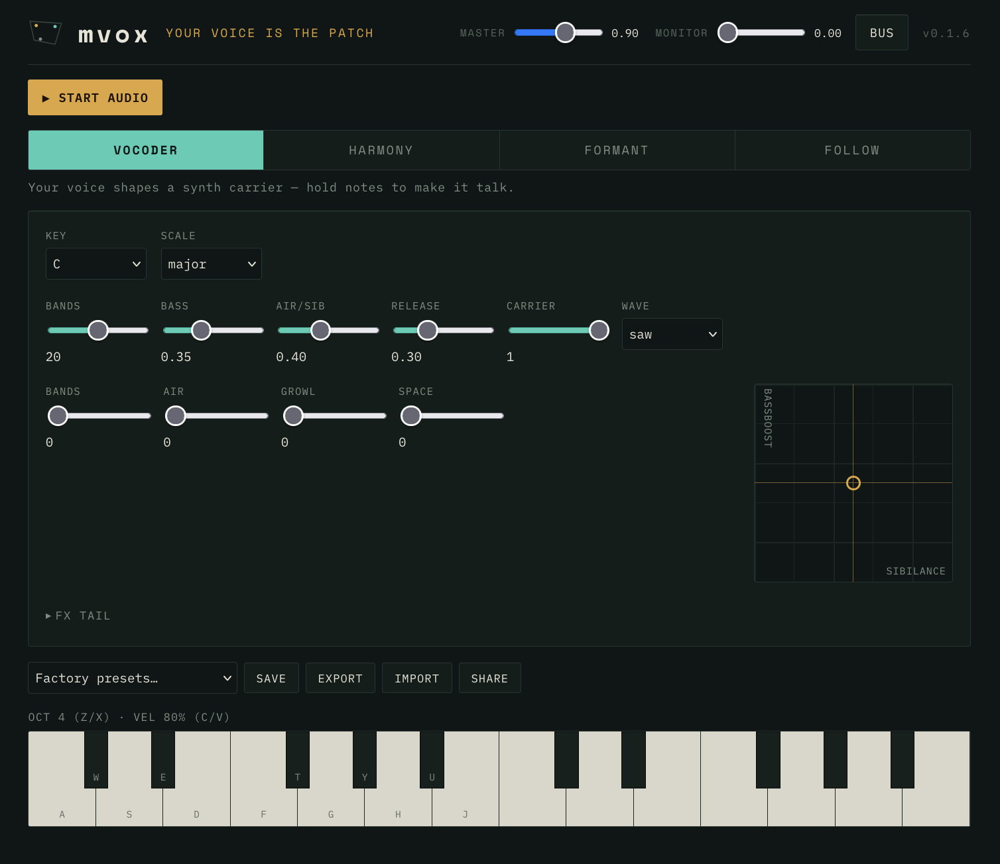

<div align="center">

# mvox

**Your voice is the patch.**

<pre>
 _ __ _____   _____ __  __
| '_ ` _ \ \ / / _ \\ \/ /
| | | | | \ V / (_) |>  <
|_| |_| |_|\_/ \___//_/\_\
</pre>

[](./package.json)
[](./LICENSE)
[](#verification)
[](./tsconfig.app.json)
[](https://react.dev)
[](https://vite.dev)
[](https://developer.mozilla.org/docs/Web/API/AudioWorklet)
[](#pwa)



</div>

---

A voice instrument for the browser. Sing, hum or speak into the mic and **play what your voice
becomes** — vocoder chords, snapped harmonies, formant creatures, and pitch-tracked synth lines.
The human voice is the one input the m-suite barely touches; mvox makes it the whole instrument.
Everything runs on-device — no account, no uploads, no telemetry.

No mic? A built-in demo voice makes every engine playable the moment you press **Start**.

## Highlights

- **Four engines, one surface.** Click-free fade-through-silence switching between:
  - **VOCODER** — a 8–32 band channel vocoder; your voice modulates a built-in poly synth carrier (saw / pulse / noise) played from the keyboard or MIDI. Bands, bass, air/sibilance passthrough, release.
  - **HARMONY** — up to 4 pitch-shifted harmony voices snapped to a chosen key/scale by diatonic interval, with level, spread, detune and formant controls.
  - **FORMANT** — direct voice mangling: movable formant colour, gender/size, robot (pitch flatten to held notes), whisper (noise excitation), ring mod.
  - **FOLLOW** — monophonic pitch-to-synth with glide; confidence-gated so silence never triggers a note.
- **Pitch tracking in the worklet** — a YIN-style detector with an octave-error guard and a confidence output, tested against synthetic f0 sweeps, harmonic-rich saws, and octave traps.
- **Performance surface** — 4 curated macros per mode, an assignable XY pad per mode, and a shared key/scale selector.
- **FX tail** — drive → chorus → tempo-syncable delay → reverb, into a master limiter.
- **Capture & share** — record the master out to a 16-bit **WAV**; 10 factory presets across the four modes; save your own to IndexedDB; export/import JSON; share a patch (never audio) via a URL fragment.
- **Polyphony** — up to 8 carrier voices, oldest-note stealing, no hung notes on mode switch or device removal, and a **PANIC** button.
- **Optional mbus publish** — the "bus" toggle in the header offers the master output to the [mbus](https://mbus.mpump.live) patchbay as a source named `mvox` (tab-to-tab WebRTC via the local **mpump** link-bridge, peer-to-peer, no server). Off by default; harmless without the bridge. The vendored mbus-client lives in `src/transport/mbus/` (provenance in its index.ts header).

## Run locally

```sh
npm install
npm run dev      # http://localhost:5173
```

Press **▶ Start audio** (audio requires a user gesture). Play with the demo voice, or enable the
mic — **wear headphones first** (a warning gates it) to avoid feedback howl.

## Scripts

| Script | Purpose |
| --- | --- |
| `npm run dev` | Vite dev server with HMR |
| `npm run build` | Type-check (`tsc -b`) then production build |
| `npm run test` | Run the Vitest suite once |
| `npm run test:watch` | Vitest in watch mode |
| `npm run lint` | ESLint (flat config, strict) |
| `npm run check` | **lint + test + build** — the full gate; green before any milestone is "done" |
| `npm run preview` | Serve the production build locally |

## Keyboard

Ableton-style computer-keyboard note layout (physical `event.code`, so it's layout-independent):

| Keys | Role |
| --- | --- |
| `A S D F G H J K` | White keys — C D E F G A B C |
| `W E · T Y U · O` | Black keys — C# D# · F# G# A# · C# |
| `Z` / `X` | Octave down / up |
| `C` / `V` | Velocity down / up |

Optional **Web MIDI** input (Chromium). Note-on velocity 0 is treated as note-off; held notes are
flushed if the device disconnects.

## Architecture

```text
        UI thread (React 19)                │        audio thread (AudioWorklet)
                                            │
  App.tsx ── useEngine ── AudioEngine ──────┼──▶ mvox.worklet ── MvoxEngineCore
     │           │            │  (mic in,   │        (routes the 4 engines)
     │           │            │   notes,    │         ├─ PitchTracker (YIN)
  ModeControls   │            │   patch,    │         ├─ CarrierSynth (8-voice)
  macros / XY    │            │   telemetry)│         ├─ vocoder banks (biquad + env)
  PresetBar      │            └── recorder ─┼──▶ recorder.worklet ─▶ WAV
                 │                          │         ├─ PitchShifter (granular)
     pure & framework-free ─────────────────┤         ├─ formant resonators
     dsp/  scale · pitch · wav · fx …        │         └─ FxChain (drive/chorus/delay/reverb)
                                            │
  contracts.ts — one typed patch schema + message protocol, shared by both sides.
  Every boundary (IndexedDB · URL · worklet · MIDI) passes through sanitizePatch().
```

All audio-rate DSP lives in pure, `new`-able classes under `src/audio/dsp/` that run in Node — the
worklet is a thin shell, and the UI never touches samples. Randomness is seeded/deterministic.

## Verification

```sh
npm run check
```

**125 tests across 13 files**, colocated with their source. The DSP contract every unit is held to:
deterministic output, `reset()` reproducibility, finite/bounded output over long renders, and
clamping of out-of-range input. Highlights:

- **Pitch tracker** — detects sine tones at 110/220/440/880 Hz within tolerance; a 220 Hz sawtooth without octave error; noise/silence → unvoiced; tracks a 200→400 Hz sweep.
- **Vocoder / biquad** — constant-peak bandpass passes its center and rejects an octave away; log-spaced band frequencies; envelope follower rise/decay; impulse-response stability.
- **Scale** — diatonic interval snapping (ties resolve down), harmony offsets across octaves, Hz↔MIDI↔cents; never emits NaN for any input.
- **Pitch shifter** — ±12 semitones tracked; ratio 1 near-transparent; bounded under full-scale noise.
- **WAV encoder** — canonical RIFF/WAVE header math, mono + stereo interleave, clamp & round to int16.
- **Presets / share / MIDI / macros** — round-trip and validation, tampered payloads clamped, MIDI byte parsing.

Real-voice behaviour — sibilance intelligibility, octave jumps, latency feel — is not unit-testable;
see the manual checklist below.

### Manual physical-device QA checklist

Run on real hardware with headphones before a release:

- [ ] **Start** on Chrome, Firefox, Safari (desktop) — worklet loads, demo voice audible.
- [ ] **Enable mic** — headphones warning appears; after consent, live voice replaces demo; dry voice is **not** monitored through output.
- [ ] **VOCODER** — hold keyboard chords while speaking; consonants ("s", "t") survive via the Air knob; bass boost thickens; no clicks on band-count change.
- [ ] **HARMONY** — sing a sustained note; harmony voices snap to the selected key/scale; changing key/scale re-targets; voice count 0→4 clean.
- [ ] **FORMANT** — shift/size move the vowel colour; robot flattens to the held note; whisper turns voiced sound breathy; ring mod at various Hz.
- [ ] **FOLLOW** — melody drives the synth; glide audible; silence does **not** trigger notes (raise/lower the gate).
- [ ] **Pitch latency/accuracy** — note perceived tracking lag and any octave errors on low male / high female voices.
- [ ] **Polyphony** — 8+ overlapping notes steal oldest; **PANIC** silences instantly; unplug a MIDI/USB mic mid-note → no hung notes.
- [ ] **Record** → WAV downloads and plays back correctly in another app.
- [ ] **Presets** — factory presets load per mode; save/load/delete a user preset; export/import JSON; **Share** link restores the patch in a fresh tab.
- [ ] **PWA** — install; reload offline; app still starts.

## Privacy

Everything is local. **No account, no cookies, no telemetry, no fingerprinting, no uploads.** Mic
audio is processed on-device only and is **never monitored through the output by default** (feedback
+ privacy) — the Monitor knob is opt-in. Presets live in your browser's IndexedDB. Share links carry
the patch in the URL fragment and never reach a server; recordings are yours to download.

## Browser notes & limitations

- **AudioWorklet + Web MIDI** work best in Chromium. Firefox and Safari run the audio engine; **Web MIDI is Chromium-only**. Safari needs a user gesture to unlock audio (handled by Start).
- Pitch tracking is a **real-time YIN** — low latency, good on clear monophonic voice; expect occasional octave slips on very low/breathy input. Documented honestly, not hidden.
- The pitch shifter is a **granular (v1)** design: musically useful, with some warble on large shifts. FORMANT's shift/size impose a **movable resonant formant colour** — an expressive approximation, not a phase-vocoder-grade formant-preserving shifter.
- Best with **headphones**; the mic is disabled until you confirm.
- **mbus publish** needs the **mpump** link-bridge running locally (`ws://localhost:19876`); without it the "bus" toggle just keeps retrying quietly and nothing is published.

## Repository map

```text
src/
  audio/
    contracts.ts        patch schema, ranges, defaults, sanitize, message protocol
    AudioEngine.ts      framework-agnostic engine: mic, worklet load, notes, recording
    mvox.worklet.ts     thin worklet shell around the core
    recorder.worklet.ts pass-through capture tap → WAV
    demoVoice.ts        synthetic vowel so it's playable with no mic
    dsp/                pure, Node-tested DSP: pitch, scale, biquad, vocoder,
                        carrier, pitchShifter, fx, wav, engineCore
  keyboard/layout.ts    Ableton-style computer-key note map
  midi/                 Web MIDI parse + router
  performance/macros.ts curated macros + XY per mode
  persistence/          factory presets, IndexedDB, export/import + migration
  sharing/codec.ts      URL-fragment patch share
  ui/                   useEngine, useKeyboard
  components/           controls, ModeControls, Keyboard, PresetBar
```

## PWA

Installable and offline after one visit. A hand-written service worker (`public/sw.js`) precaches
the app shell plus the hashed build assets listed in a generated `precache-manifest.json`;
navigations are network-first (so a deploy can't strand you on stale HTML), other assets cache-first
with an LRU bound.

## Deployment

Static — deploy `dist/` anywhere. For a sub-path host (e.g. GitHub Pages) set `VITE_BASE_PATH`:

```sh
VITE_BASE_PATH=/mvox/ npm run build
```

## Family

Part of the **m-suite** of free, local-first browser music tools: mpump, mloop, mdrone, mchord,
mgrains, mspectr, mscope — and now mvox.

## License

[AGPL-3.0-or-later](./LICENSE).
